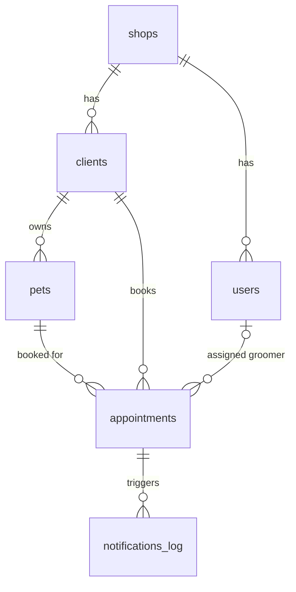

# Database Schema Draft (first pass)

Rough first-pass schema for the MVP. Design only: nothing here has been applied to the database, and no ORM has been chosen.

Conventions assumed for now:

- `id` is a `uuid` primary key on every table.
- `created_at` / `updated_at` are `timestamptz` on every table.
- Every tenant-owned table carries `shop_id` (marked **[tenant]** below). Full tenant isolation (RLS, composite keys, etc.) is deliberately not solved yet.

---

## shops

One row per grooming business (the tenant).

- `id` (PK)
- `name`
- `email`
- `phone`
- `timezone` — IANA name, e.g. `Europe/Lisbon`
- `created_at`, `updated_at`

## users

Staff who log in to the app.

- `id` (PK)
- `shop_id` (FK → shops) **[tenant]**
- `email` — unique
- `full_name`
- `role` — `owner` | `admin` | `groomer`
- `is_active`
- `created_at`, `updated_at`

Note: Supabase Auth could later own the login identity; if so, a nullable `auth_user_id` linking to `auth.users` would be added here. Not decided yet.

## clients

The shop's customers (pet owners). They do not log in.

- `id` (PK)
- `shop_id` (FK → shops) **[tenant]**
- `first_name`
- `last_name`
- `email`
- `phone`
- `email_notifications_enabled` — opt-in/out for reminders
- `notes`
- `created_at`, `updated_at`

## pets

- `id` (PK)
- `shop_id` (FK → shops) **[tenant]**
- `client_id` (FK → clients)
- `name`
- `species` — `dog` | `cat` | `other`
- `breed` — free text
- `date_of_birth`
- `weight_kg`
- `notes` — grooming / medical / behaviour notes
- `created_at`, `updated_at`

## appointments

The central entity.

- `id` (PK)
- `shop_id` (FK → shops) **[tenant]**
- `client_id` (FK → clients)
- `pet_id` (FK → pets)
- `groomer_id` (FK → users, nullable) — assigned staff member
- `starts_at` — `timestamptz`
- `ends_at` — `timestamptz`
- `service_description` — free text for now (a `services` table can come later)
- `status` — `scheduled` | `completed` | `cancelled` | `no_show`
- `price` — nullable
- `notes`
- `created_at`, `updated_at`

`client_id` is stored directly as well as being reachable via the pet, because reminders and client history need the client without an extra join. Keeping them consistent is a later concern.

## notifications_log

One row per email the system tried to send.

- `id` (PK)
- `shop_id` (FK → shops) **[tenant]**
- `appointment_id` (FK → appointments)
- `client_id` (FK → clients)
- `type` — `appointment_reminder` | `missed_appointment`
- `recipient_email` — snapshot of the address used
- `status` — `pending` | `sent` | `failed`
- `scheduled_for` — when it should be sent
- `sent_at`
- `provider_message_id`
- `error_message`
- `created_at`, `updated_at`

---

## Relationships

- shop → users, clients, pets, appointments, notifications_log (all carry `shop_id`)
- client → pets
- client + pet → appointments; appointment → optional groomer (user)
- appointment (+ client) → notifications_log

## Assumptions

- One user belongs to exactly one shop.
- Appointments store absolute instants (`timestamptz`); the shop's timezone is used only to display them.
- A service is just text on the appointment for now.
- Removing a client, pet or user will most likely be a soft delete (flag/timestamp), so appointment history is kept.

## Left undecided

- Supabase Auth vs application-owned authentication.
- Tenant isolation mechanics (RLS, composite foreign keys, query scoping).
- Indexes, uniqueness rules, and overlap prevention for groomer schedules.
- Reminder timing and retry policy for notifications.
- Whether `services`, `shop_memberships` (multi-shop users) or an audit table are needed later.
